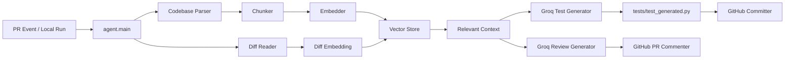
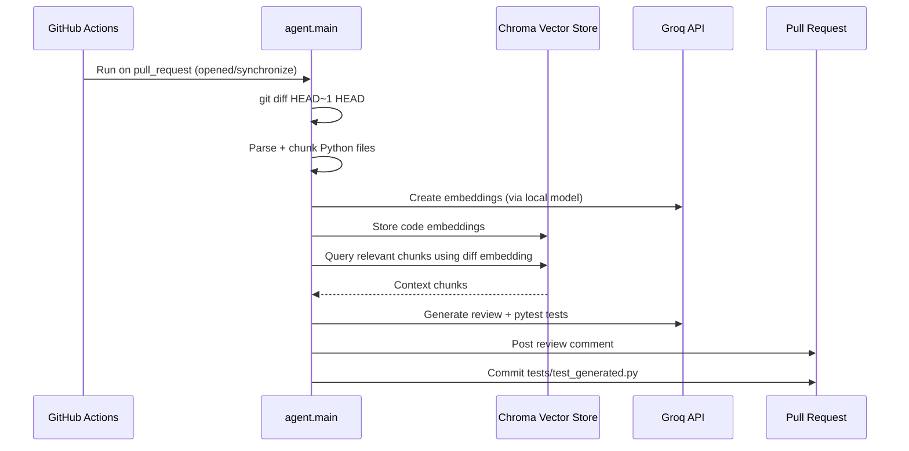

# apricot

[](https://github.com/Neuropole/apricot)

Apricot is a self-hosted AI code agent for pull requests.  
It analyzes the latest Git diff, retrieves relevant code context from the repository, generates:

1. **A structured review comment**
2. **Pytest test cases** (saved to `tests/test_generated.py`)

Then it can post the review on the PR and commit generated tests back to the PR branch.

---

## What it does

- Reads recent code changes (`git diff HEAD~1 HEAD`)
- Builds context from Python files in the repo
- Chunks + embeds code with Sentence Transformers
- Stores/query embeddings with ChromaDB
- Uses Groq LLM for:
  - review generation
  - pytest generation
- Publishes output to GitHub PR comments
- Commits generated tests to the source PR branch

---

## Architecture



### Runtime flow



---

## Project structure

```text
apricot/
├── .github/workflows/agent.yml
├── agent/
│   ├── main.py
│   ├── config.py
│   ├── llm/
│   │   ├── groq_client.py
│   │   ├── prompts.py
│   │   └── test_generator.py
│   ├── indexing/
│   │   ├── parser.py
│   │   ├── chunker.py
│   │   ├── embedder.py
│   │   └── vector_store.py
│   └── github/
│       ├── commenter.py
│       └── committer.py
├── tests/
│   ├── test_generated.py
│   └── test_test_generator_formatting.py
└── requirements.txt
```

---

## Quick start (local)

### 1) Install dependencies

```bash
pip install -r requirements.txt
```

### 2) Configure environment variables

Create a `.env` file in the repository root:

```env
GROQ_API_KEY=your_groq_api_key
GITHUB_TOKEN=your_github_token
GITHUB_REPOSITORY=owner/repo
PR_NUMBER=123
GITHUB_HEAD_REF=feature-branch-name
```

### 3) Run the agent

```bash
python -m agent.main
```

---

## GitHub Actions integration

This repo includes `.github/workflows/agent.yml` that triggers on:

- `pull_request` events: `opened`, `synchronize`

The workflow:

1. checks out code with full history
2. sets PR number
3. installs Python + requirements
4. runs `python -m agent.main`

Required secrets:

- `GROQ_API_KEY`
- `GITHUB_TOKEN` (GitHub-provided token works in Actions)

---

## Outputs

Apricot produces:

- **PR review comment** (bugs, improvements, suggestions)
- **Generated tests file** at `tests/test_generated.py`

---


### CI pulse


### AI activity banner (animated)


---

## Notes and current scope

- Current implementation focuses on **Python codebases**
- Test generation currently targets **pytest**
- Diff source is the latest commit range (`HEAD~1..HEAD`)

---

## License

MIT License (see `LICENSE`).
